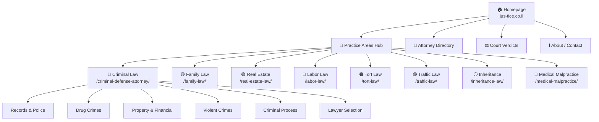

# Jus-Tice.co.il — Master Site Architecture & SEO Blueprint
**Last Updated:** 2026-05-14T00:40+03:00
**Status:** Phase 1 (Criminal Law) COMPLETE → Phase 2 Planning

---

## 1. Site Identity

| Property | Value |
|----------|-------|
| Domain | `jus-tice.co.il` |
| Type | Legal portal (multi-practice, attorney directory) |
| Language | Hebrew (RTL) + English URLs |
| CMS | WordPress (uPress hosted, Git-deployed) |
| Theme | `justice-theme` (custom) |
| Content CPT | `articles` (XML-RPC publishing) |
| Lawyer CPT | `justice_lawyer` |
| Lead CPT | `justice_lead` |
| Legacy CPTs | `labor_law`, `small_claims`, `corona_virus`, `supreme_court`, `tort`, `goverment-gazette`, `yada_wiki` |

---

## 2. Complete Site Tree



---

## 3. Criminal Law Cluster (PHASE 1 — ✅ DEPLOYED)

**Pillar:** `/criminal-defense-attorney/` (ID 857, 22.4K chars)

### Cluster Map

| Cluster | Spoke URL | Post ID | Status |
|---------|-----------|---------|--------|
| **Records & Police** | | | |
| | `/criminal-record-check/` | 19257 | ✅ Live + E-E-A-T |
| | `/criminal-record-deletion/` | 19259 | ✅ Live + E-E-A-T |
| | `/lahav-433-guide/` | 19267 | ✅ Live + E-E-A-T |
| **Drug Crimes** | | | |
| | `/drug-crimes/` (sub-hub) | 19263 | ✅ Live + E-E-A-T |
| | `/drug-possession/` | 19275 | ✅ Live + E-E-A-T |
| | `/drug-trafficking/` | 19273 | ✅ Live + E-E-A-T |
| | `/driving-under-influence/` | 19277 | ✅ Live + E-E-A-T |
| **Property & Financial** | | | |
| | `/shoplifting-defense/` | 19265 | ✅ Live + E-E-A-T |
| | `/fraud-types/` | 19281 | ✅ Live + E-E-A-T |
| | `/tax-crimes/` | 19300 | ✅ Live + E-E-A-T |
| **Violent Crimes** | | | |
| | `/murder-charges/` | 19271 | ✅ Live + E-E-A-T |
| | `/criminal-negligence/` | 19302 | ✅ Live + E-E-A-T |
| **Criminal Process** | | | |
| | `/police-investigation-rights/` | 19269 | ✅ Live + E-E-A-T |
| | `/arrest-rights/` | 19283 | ✅ Live + E-E-A-T |
| | `/plea-bargain/` | 19279 | ✅ Live + E-E-A-T |
| | `/criminal-appeal/` | 19304 | ✅ Live + E-E-A-T |
| **Lawyer Selection** | | | |
| | `/criminal-lawyer-cost/` | 19261 | ✅ Live + E-E-A-T |

### Criminal Verdicts (TODO)

| URL | Topic | Priority |
|-----|-------|----------|
| `/verdicts/criminal/` | Criminal verdicts hub | HIGH |
| `/verdicts/criminal/drug-offenses/` | Drug case verdicts | MED |
| `/verdicts/criminal/fraud/` | Fraud case verdicts | MED |
| `/verdicts/criminal/violence/` | Violence verdicts | MED |

---

## 4. Future Practice Area Clusters (PHASE 3+)

### 4.1 Family Law (🟡 HIGH PRIORITY — 8,508+ imp for "משמורת ילדים")

| URL | Topic | GSC Signal |
|-----|-------|------------|
| `/family-law/` | PILLAR | cannibalized |
| `/child-custody/` | משמורת ילדים | 8,508 imp |
| `/divorce-process/` | הליך גירושין | HIGH |
| `/alimony/` | מזונות | HIGH |
| `/prenuptial-agreement/` | הסכם ממון | MED |
| `/domestic-violence/` | אלימות במשפחה | MED |
| `/child-support/` | מזונות ילדים | HIGH |
| `/property-division/` | חלוקת רכוש | MED |

### 4.2 Real Estate Law (🟢 HIGH PRIORITY — 11,218 imp for "עורך דין מקרקעין")

| URL | Topic | GSC Signal |
|-----|-------|------------|
| `/real-estate-law/` | PILLAR | 2 pages cannibalized |
| `/buying-apartment/` | רכישת דירה | HIGH |
| `/real-estate-contract/` | חוזה מקרקעין | HIGH |
| `/land-registry/` | טאבו רישום מקרקעין | MED |
| `/urban-renewal/` | פינוי בינוי / תמ"א 38 | MED |
| `/construction-defects/` | ליקויי בנייה | MED |

### 4.3 Labor Law (🔵 MEDIUM PRIORITY)

| URL | Topic |
|-----|-------|
| `/labor-law/` | PILLAR |
| `/wrongful-termination/` | פיטורים שלא כדין |
| `/severance-pay/` | פיצויי פיטורים |
| `/workplace-harassment/` | הטרדה בעבודה |
| `/employment-contract/` | חוזה עבודה |

### 4.4 Tort / Personal Injury (🟠 MEDIUM PRIORITY)

| URL | Topic |
|-----|-------|
| `/tort-law/` | PILLAR |
| `/car-accident-claim/` | תביעת תאונת דרכים |
| `/slip-and-fall/` | נפילה במקום ציבורי |
| `/medical-malpractice/` | רשלנות רפואית |

### 4.5 Traffic Law (🟣 MEDIUM PRIORITY)

| URL | Topic |
|-----|-------|
| `/traffic-law/` | PILLAR |
| `/license-suspension/` | שלילת רישיון |
| `/speeding-ticket/` | דוח מהירות |
| `/traffic-court/` | בית משפט לתעבורה |

### 4.6 Inheritance & Wills (⚪ LOWER PRIORITY)

| URL | Topic |
|-----|-------|
| `/inheritance-law/` | PILLAR |
| `/writing-a-will/` | כתיבת צוואה |
| `/inheritance-dispute/` | סכסוך ירושה |
| `/estate-management/` | ניהול עיזבון |

---

## 5. SEO Infrastructure Audit

### ✅ ALREADY BUILT IN THEME

| Feature | File | Status |
|---------|------|--------|
| Breadcrumbs (visual) | `inc/breadcrumbs.php` | ✅ Working |
| BreadcrumbList Schema (JSON-LD) | `inc/schema.php` | ✅ Working |
| Article Schema | `inc/schema.php` | ✅ Auto on articles |
| WebSite Schema (homepage) | `inc/schema.php` | ✅ Working |
| Attorney Schema | `inc/schema.php` | ✅ On lawyer profiles |
| LegalService Schema | `inc/schema.php` | ✅ Via worksFor |
| SEO meta tags | `inc/seo.php` | ✅ title, description |
| Canonical URLs | `inc/seo.php` | ✅ Working |
| Practice area cards | `template-parts/cards/practice-area-card.php` | ✅ Working |
| Topic clusters | `template-parts/sections/topic-clusters.php` | ✅ Working |

### ❌ MISSING / NEEDS WORK

| Feature | Priority | Action Required |
|---------|----------|-----------------|
| **XML Sitemap** | 🔴 CRITICAL | 0 sitemaps in GSC! Need to generate + submit |
| **FAQPage Schema** | 🔴 HIGH | All articles have FAQ sections but no FAQ schema |
| **LegalService Schema (homepage)** | 🟡 HIGH | Add org-level LegalService schema to homepage |
| **Category assignment** | 🟡 HIGH | New articles not assigned to WP categories |
| **Featured images** | 🟡 HIGH | No thumbnails on new articles |
| **Meta descriptions** | 🟡 HIGH | Not set via XML-RPC (need `seo_description` meta) |
| **Open Graph tags** | 🟡 MED | Check if og:image set for social sharing |
| **Hreflang** | ⚪ LOW | Not needed (single-language site) |
| **robots.txt** | 🟡 MED | Verify it allows crawling of new URLs |

---

## 6. Category & Taxonomy Plan

### Current WP Categories (need cleanup)
The existing categories are mostly Hebrew-slug labor law categories. We need to create proper English-slug practice area categories.

### Proposed Category Structure

```
Practice Areas (parent: 0) — ID 699 (EXISTS)
├── criminal-law          — "משפט פלילי"
├── family-law            — "משפחה וגירושין"  
├── real-estate-law       — "מקרקעין ונדל\"ן"
├── labor-law             — "דיני עבודה"
├── tort-law              — "נזיקין ותאונות"
├── traffic-law           — "דיני תעבורה"
├── inheritance-law       — "ירושה וצוואות"
└── medical-malpractice   — "רשלנות רפואית"
```

> [!IMPORTANT]
> All 18 criminal law articles need to be assigned to a `criminal-law` category. This can be done via XML-RPC `wp.editPost` by adding `terms` parameter.

---

## 7. Navigation / Menu Structure

### Proposed Main Menu

```
🏠 ראשי
📂 תחומי משפט ▼
   ├── משפט פלילי
   ├── משפחה וגירושין
   ├── מקרקעין ונדל"ן
   ├── דיני עבודה
   ├── נזיקין ותאונות
   ├── דיני תעבורה
   └── ירושה וצוואות
⚖️ פסקי דין
👤 מצא עורך דין
ℹ️ אודות
📞 צור קשר
```

### Breadcrumb Path Examples

```
Home > תחומי משפט > משפט פלילי > עבירות סמים > סחר בסמים
Home > תחומי משפט > משפט פלילי > זכויות הנחקר
Home > תחומי משפט > משפחה וגירושין > משמורת ילדים
Home > פסקי דין > פלילי > עבירות סמים
```

---

## 8. Schema Markup Implementation Plan

### 8.1 Homepage — LegalService + WebSite (Dual Schema)

```json
{
  "@context": "https://schema.org",
  "@type": "LegalService",
  "name": "ג'סטיס - פורטל משפטי",
  "url": "https://jus-tice.co.il",
  "telephone": "03-6161535",
  "email": "info@jus-tice.co.il",
  "address": {
    "@type": "PostalAddress",
    "addressCountry": "IL"
  },
  "areaServed": {
    "@type": "Country",
    "name": "Israel"
  },
  "knowsAbout": [
    "Criminal Law", "Family Law", "Real Estate Law",
    "Labor Law", "Tort Law", "Traffic Law"
  ]
}
```

### 8.2 Article Pages — Article + FAQPage

Every article that has an FAQ section should emit dual schema:
- `Article` schema (already working)
- `FAQPage` schema (needs to be added)

```json
{
  "@context": "https://schema.org",
  "@type": "FAQPage",
  "mainEntity": [
    {
      "@type": "Question",
      "name": "האם אפשר למחוק רישום פלילי?",
      "acceptedAnswer": {
        "@type": "Answer",
        "text": "כן, בתנאים מסוימים..."
      }
    }
  ]
}
```

### 8.3 Practice Area Pillar Pages — CollectionPage

```json
{
  "@context": "https://schema.org",
  "@type": "CollectionPage",
  "name": "משפט פלילי",
  "description": "מדריכים מקצועיים בתחום המשפט הפלילי",
  "hasPart": [
    {"@type": "Article", "url": "/drug-crimes/"},
    {"@type": "Article", "url": "/murder-charges/"}
  ]
}
```

---

## 9. Sitemap Strategy

### XML Sitemap (CRITICAL — Currently 0 sitemaps in GSC!)

> [!CAUTION]
> Google Search Console shows **0 sitemaps registered**. This means Google is discovering pages only through crawling. Submitting a sitemap will significantly accelerate indexing of all 18 new articles.

**Options:**
1. **Yoast/RankMath plugin** — auto-generates at `/sitemap_index.xml`
2. **Custom PHP** — add to theme's `functions.php`
3. **Manual XML** — generate and upload via Git

**Priority URLs for sitemap:**
```xml
<url><loc>https://jus-tice.co.il/</loc><priority>1.0</priority></url>
<url><loc>https://jus-tice.co.il/criminal-defense-attorney/</loc><priority>0.9</priority></url>
<!-- All 17 spoke articles at priority 0.8 -->
<!-- All verdict pages at priority 0.7 -->
<!-- Attorney directory pages at priority 0.6 -->
```

### HTML Sitemap (User-Facing)
A visible `/sitemap/` page with all practice areas and their articles, organized hierarchically. Helps both users and crawlers.

---

## 10. Prioritized TODO List

### 🔴 CRITICAL (Do This Week)

| # | Task | Impact |
|---|------|--------|
| 1 | **Generate & submit XML sitemap to GSC** | Indexing of 18 new articles |
| 2 | **Assign criminal-law category** to all 18 articles | Category pages, breadcrumbs |
| 3 | **Set meta descriptions** (seo_description) on all articles | CTR improvement |
| 4 | **Add FAQPage schema** to articles with FAQ sections | Rich snippets |
| 5 | **Sync uPress dashboard** after Git push | Deploy to production |

### 🟡 HIGH (Next 2 Weeks)

| # | Task | Impact |
|---|------|--------|
| 6 | Generate featured images for all articles | Social sharing, OG tags |
| 7 | Add LegalService schema to homepage | Brand authority |
| 8 | Create criminal-law category landing page | Category SEO |
| 9 | Begin Family Law cluster (highest GSC demand after criminal) | New traffic |
| 10 | Begin Real Estate Law cluster (11K imp cannibalized) | New traffic |

### 🟢 MEDIUM (Next Month)

| # | Task | Impact |
|---|------|--------|
| 11 | Build verdicts section `/verdicts/criminal/` | Content depth |
| 12 | Create HTML sitemap page | Crawlability |
| 13 | Expand all criminal articles to 5K+ words each | Content authority |
| 14 | Labor Law cluster | Practice area coverage |
| 15 | Internal linking audit across all articles | Link equity |
| 16 | Update main menu to include new practice areas | Navigation |

### ⚪ ONGOING

| Task | Frequency |
|------|-----------|
| Monitor GSC for ranking changes | Weekly |
| Check for new cannibalization | Bi-weekly |
| Update article dates ("עודכן לאחרונה") | Monthly |
| Add new verdict pages | As available |
| Expand attorney directory | Ongoing |

---

## 11. Content Quality Standards (All Practice Areas)

### E-E-A-T Requirements for Every Article

| Signal | Implementation |
|--------|---------------|
| **Experience** | "ניסיון מעשי של למעלה מעשור" |
| **Expertise** | Cite specific law sections (e.g., סעיף 300 לחוק העונשין) |
| **Authority** | Link to nevo.co.il, kolzchut.org.il, gov.il |
| **Trust** | Disclaimer on every page, "עודכן לאחרונה" date |
| **Author** | Named author (עו"ד בן בטש) on every article |

### Anti-AI Detection Rules

| Rule | Details |
|------|---------|
| No long em-dashes (—) | Use commas or periods instead |
| No "AI voice" phrases | No "In conclusion", "It's important to note" |
| Hebrew natural tone | Write like an Israeli lawyer talks |
| Specific examples | Use real law sections, not generic |
| Varied sentence length | Mix short and long sentences |

### Internal Linking Rules

| Rule | Details |
|------|---------|
| Every spoke → its pillar | Anchor text = pillar keyword |
| Pillar → all spokes | In spoke navigation hub |
| Related spokes → each other | Contextual cross-links |
| No orphan pages | Every page has at least 3 internal links |
| Max 3 clicks from homepage | Shallow architecture |

---

## 12. Technical Reminders

| Item | Details |
|------|---------|
| **Credentials** | `tools/gsc/wp-app-password.json` (gitignored) |
| **Publisher** | `clusters/criminal-law/quick-publish.js` |
| **E-E-A-T updater** | `clusters/criminal-law/enrich-eeat.js` |
| **Pillar updater** | `clusters/criminal-law/update-pillar-eeat.js` |
| **GSC tools** | `tools/gsc/gsc-pull.js` |
| **Git remote** | `github.com/The-new-ben/justice-theme.git` |
| **Deploy** | Git push → uPress Sync (manual) |
| **WP user** | `benbatash` (ID 282) |

---

> [!TIP]
> **Quick Reference:** To deploy a new article:
> 1. Write HTML file in `clusters/<practice-area>/article-<slug>.html`
> 2. Run: `node quick-publish.js "<slug>" "<path-to-html>"`
> 3. Run: `node enrich-eeat.js` (or include E-E-A-T in the HTML)
> 4. Git add, commit, push
> 5. User syncs uPress dashboard
